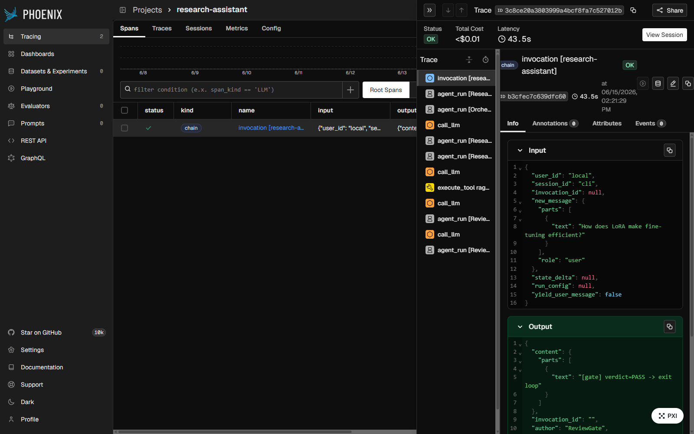

# Research Assistant — Multi-Agent Intelligence System (Google ADK)

A multi-agent research assistant that answers questions over a curated corpus of
**AI/ML papers** (RAG) and the **live web** (Tavily), built on **Google's Agent
Development Kit (ADK)**. An orchestrator routes each query, a researcher gathers
evidence, and a reviewer enforces groundedness before the answer is returned —
with full observability and an automated evaluation harness.

Built as the capstone for the Synapse "Master Agentic AI" certification and as an
AI-engineering portfolio project.

**Live demo (chatbot):** https://research-assistant-ui-969189630215.us-central1.run.app — a Streamlit chat UI over the API. Backend API: https://research-assistant-969189630215.us-central1.run.app (`GET /health`, `POST /ask {"question": "..."}`).

---

## Highlights

- **3 collaborating agents** on Gemini 2.5 (Orchestrator, Researcher, Reviewer/QA) with a deterministic control spine.
- **4 communication patterns** (rubric requires 2+): hierarchical delegation, sequential flow, feedback loop, parallel execution.
- **Grounded RAG** over 15 arXiv papers (Vertex `text-embedding-005` → FAISS), with inline citations.
- **Smart routing** — corpus facts → RAG, "latest/2026" → web, mixed → both.
- **Evaluated**: Ragas (faithfulness, answer relevancy, context precision/recall) + deterministic routing accuracy.
- **Observable**: structured per-step metrics plus an Arize Phoenix OpenTelemetry trace UI.
- **Deployable**: FastAPI service, Dockerized for Cloud Run, with a thin Streamlit demo client.

---

## Architecture

```
user query
   │
   ▼
┌──────────────┐  Orchestrator (LlmAgent)
│ Orchestrator │  classifies the query → CORPUS | WEB | BOTH, writes the route to session state
└──────┬───────┘
       ▼              ┌──────── feedback loop (max 2 iterations) ────────┐
┌──────────────┐      │  ┌──────────────┐  Researcher (LlmAgent + tools)  │
│  Researcher  │◀─────┤  │  Researcher  │  rag_search (FAISS) + web_search │
│              │      │  └──────┬───────┘  (run in parallel when BOTH)      │
└──────┬───────┘      │         ▼ draft + sources                          │
       ▼              │  ┌──────────────┐  Reviewer/QA (LlmAgent)           │
┌──────────────┐      │  │  Reviewer/QA │  groundedness + citation check    │
│ Reviewer/QA  │      │  └──────┬───────┘  emits PASS / FAIL verdict        │
└──────┬───────┘      │         ▼                                          │
       ▼              │  ┌──────────────┐  ReviewGate (control node)        │
  final cited         │  │  ReviewGate  │  PASS → stop loop; FAIL → revise  │
  answer              │  └──────────────┘                                  │
                      └──────────────────────────────────────────────────┘
```

**Topology:** `SequentialAgent[ Orchestrator, LoopAgent(max_iterations=2)[ Researcher, Reviewer, ReviewGate ] ]`.

**Communication patterns**
| Pattern | Where |
|---|---|
| Hierarchical delegation | Orchestrator's route drives the Researcher's tool choice via session state |
| Sequential flow | Orchestrate → research → review → finalize (the root `SequentialAgent`) |
| Feedback loop | Reviewer FAIL → Researcher revises (the `LoopAgent`) |
| Parallel execution | Researcher fires `rag_search` + `web_search` concurrently when route is BOTH |

**State** flows through ADK session state (`query_type`, `retrieved_context`,
`draft_answer`, `review_verdict`). The loop exit is **deterministic**: the Reviewer
emits a text PASS/FAIL verdict and a tiny `ReviewGate` control node escalates on
PASS — keeping the stop decision out of the LLM's hands (see
[docs/decisions.md](docs/decisions.md)).

---

## Stack

| Layer | Choice |
|---|---|
| Agent framework | Google ADK (Python) |
| LLM | Gemini 2.5 Flash (agents); Gemini 2.5 Pro (eval judge) |
| Embeddings | Vertex AI `text-embedding-005` (768-dim) |
| Vector store | FAISS (`IndexFlatIP`, on-disk) |
| Web search | Tavily |
| PDF extraction | `pypdf` |
| Serving | FastAPI + Uvicorn → Docker → Cloud Run |
| Demo UI | Streamlit |
| Observability | `ObservabilityPlugin` (ADK) + Arize Phoenix (OpenTelemetry) |
| Evaluation | Ragas (Gemini judge + Vertex embeddings) |

The agent core deliberately avoids LangChain/LlamaIndex to show the RAG
primitives directly. (LangChain appears only as an isolated, eval-only dependency
for Ragas — never in the served app.)

---

## Corpus

15 well-known arXiv papers on transformers, LLMs, RAG, retrieval, agents, and
efficiency (Attention Is All You Need, BERT, GPT-3, RAG, DPR, Chain-of-Thought,
ReAct, Toolformer, LoRA, FlashAttention, Llama 2, Self-RAG, HyDE, Lost in the
Middle, Mixtral). PDFs are reproducible via `scripts/download_corpus.py`
(tracked: [knowledge_base/manifest.json](knowledge_base/manifest.json); the PDFs
themselves are gitignored). Chunked into ~1,140 passages (500-token windows,
50-token overlap) with paper/page metadata for citations.

---

## Setup

**Prerequisites:** Python 3.11+, [`uv`](https://docs.astral.sh/uv/), a
billing-enabled GCP project with Vertex AI enabled, and a Tavily API key.

```bash
# 1. Install dependencies
uv sync

# 2. Authenticate to Google Cloud (Application Default Credentials)
gcloud auth application-default login
gcloud config set project <YOUR_PROJECT_ID>

# 3. Configure environment (.env)
#   GOOGLE_GENAI_USE_VERTEXAI=true
#   GOOGLE_CLOUD_PROJECT=<YOUR_PROJECT_ID>
#   GOOGLE_CLOUD_LOCATION=us-central1
#   TAVILY_API_KEY=<YOUR_TAVILY_KEY>

# 4. Build the corpus + FAISS index
uv run python scripts/download_corpus.py     # fetch the 15 PDFs
uv run python -m src.rag.embedder            # embed → faiss_index/
```

> On Windows, prefix run commands with `PYTHONIOENCODING=utf-8` so paper math
> symbols don't crash the console (`cp1252`).

---

## Usage

```bash
# CLI — streams the live agent trace, prints the cited answer + metrics
uv run python -m src.cli "What is scaled dot-product attention?"

# API — FastAPI service
uv run python -m uvicorn src.main:app --port 8080
#   POST /ask   {"question": "..."}     →  {answer, route, review_verdict, metrics}
#   GET  /health

# Demo UI — thin Streamlit chat client over the API (deployed separately, see Deployment)
API_URL=http://localhost:8080 uv run streamlit run ui/app_streamlit.py
```

---

## Evaluation

The harness ([eval/run_eval.py](eval/run_eval.py)) runs a labeled question set
([eval/dataset.jsonl](eval/dataset.jsonl) — 19 rows: 15 corpus, 2 web, 2 mixed)
through the full pipeline, then measures two things:

1. **RAG answer quality** — for every corpus/mixed question (those with a
   reference answer), four Ragas metrics scored by a Gemini 2.5 Pro judge and
   Vertex embeddings.
2. **Routing accuracy** — deterministic check of the Orchestrator's route vs the
   expected route across **all** rows, including web (live-web answers have no
   stable reference, so we grade their routing rather than their content).

### Results

| Metric | Score | What it measures |
|---|---|---|
| Routing accuracy | **19/19 (100%)** | did the Orchestrator route to the right source? |
| Faithfulness | **0.98** | is every claim grounded in the retrieved context? |
| Answer relevancy | **0.83** | does the answer actually address the question? |
| Context precision | **0.81** | are the retrieved passages relevant / well-ranked? |
| Context recall | **0.93** | did retrieval surface what the reference needs? |

_15 corpus rows scored; judge = `gemini-2.5-pro`, embeddings = `text-embedding-005`._

```bash
uv sync --group eval                          # install eval-only deps
uv run python -m eval.run_eval                # full run (spends Gemini credit)
uv run python -m eval.run_eval --limit 1      # quick smoke
uv run python -m eval.run_eval --skip-ragas   # routing only, no judge calls
```

Full results are written to [eval/results.md](eval/results.md).

---

## Observability

Two complementary layers:

**1. In-process metrics — `ObservabilityPlugin`.** A single ADK `BasePlugin`
attached to the Runner captures, per run: the route decision, every agent/tool
latency (via `perf_counter`), Gemini token counts (prompt/candidates/thinking),
retrieval cosine scores, and the RAG-vs-web tool split. It emits one structured
JSON record per step to `logs/trace-<session>.jsonl` and exposes a `metrics`
dict that the FastAPI app returns with every answer. This is the rubric's
observability requirement and needs no external service.

**2. Trace UI — Arize Phoenix (OpenTelemetry).** Optional, flag-gated, and
self-hosted (no signup). When enabled, the full agent run renders as a trace
waterfall — every agent step, tool call, LLM prompt, and token count — at
`http://localhost:6006`. The Phoenix/OpenInference packages live in the
eval-only dependency group and are lazy-imported, so production and the Cloud Run
image are never affected.

```bash
uv sync --group eval
phoenix serve                                 # terminal 1 — collector + UI at :6006
PHOENIX_ENABLED=true uv run python -m src.cli "How has RAG evolved?"   # terminal 2
```



_A single query traced end-to-end: the `invocation` root fans out to the
`ResearchAssistant` spine → `Orchestrator` (route) → `ResearchReviewLoop` →
`Researcher` (with its `rag_search` tool call) → `Reviewer` → `ReviewGate`, every
span carrying its own latency and token counts._

---

## Deployment

Two Cloud Run services:

- **Chatbot UI (demo):** https://research-assistant-ui-969189630215.us-central1.run.app
  — a thin Streamlit chat client ([ui/](ui/)).
- **API (backend):** https://research-assistant-969189630215.us-central1.run.app
  — FastAPI `/ask` + `/health`. Public, capped at 3 instances, scales to zero when idle.

The API is containerized for **Google Cloud Run** ([Dockerfile](Dockerfile)):
a `uv`-based image built from `uv.lock`, with the prebuilt FAISS index baked in
(corpus PDFs and eval deps excluded). Vertex/Gemini auth comes from the Cloud Run
service identity (ADC) — no keys baked into the image; `gcloud run deploy --source`
uses [.gcloudignore](.gcloudignore) so the gitignored index still uploads. The UI is
a separate, lean image ([ui/Dockerfile](ui/Dockerfile)) that holds no credentials —
it only POSTs to the API via its `API_URL` env var.

```bash
# API — deploy to Cloud Run (built in-cloud via Cloud Build)
gcloud run deploy research-assistant --source . --region us-central1 \
  --allow-unauthenticated --memory 1Gi \
  --set-env-vars GOOGLE_GENAI_USE_VERTEXAI=true,GOOGLE_CLOUD_PROJECT=<id>,GOOGLE_CLOUD_LOCATION=us-central1,TAVILY_API_KEY=<key>

# Demo UI — separate lean service that points at the API
gcloud run deploy research-assistant-ui --source ui --region us-central1 \
  --allow-unauthenticated --memory 512Mi \
  --set-env-vars API_URL=https://research-assistant-969189630215.us-central1.run.app
```

---

## Project layout

```
src/
  agents/         orchestrator, researcher, reviewer, review_gate, root agent
  rag/            chunker, embedder, retriever (PDF → Vertex embed → FAISS)
  tools/          rag_search, web_search (ADK tools)
  observability/  ObservabilityPlugin + Phoenix setup
  pipeline.py     run_query() — shared request/response core (API + UI)
  main.py         FastAPI app
  cli.py          live-trace CLI runner
eval/             Ragas + routing evaluation harness and dataset
knowledge_base/   corpus manifest (PDFs downloaded via scripts/)
Dockerfile        container image (Cloud Run / local docker build)
docs/             design, decisions, and session logs
```

---

## Documentation

- [docs/cert-capstone-design.md](docs/cert-capstone-design.md) — architecture + rubric mapping
- [docs/decisions.md](docs/decisions.md) — architectural decision log
- [docs/sessions.md](docs/sessions.md) — per-session build log
